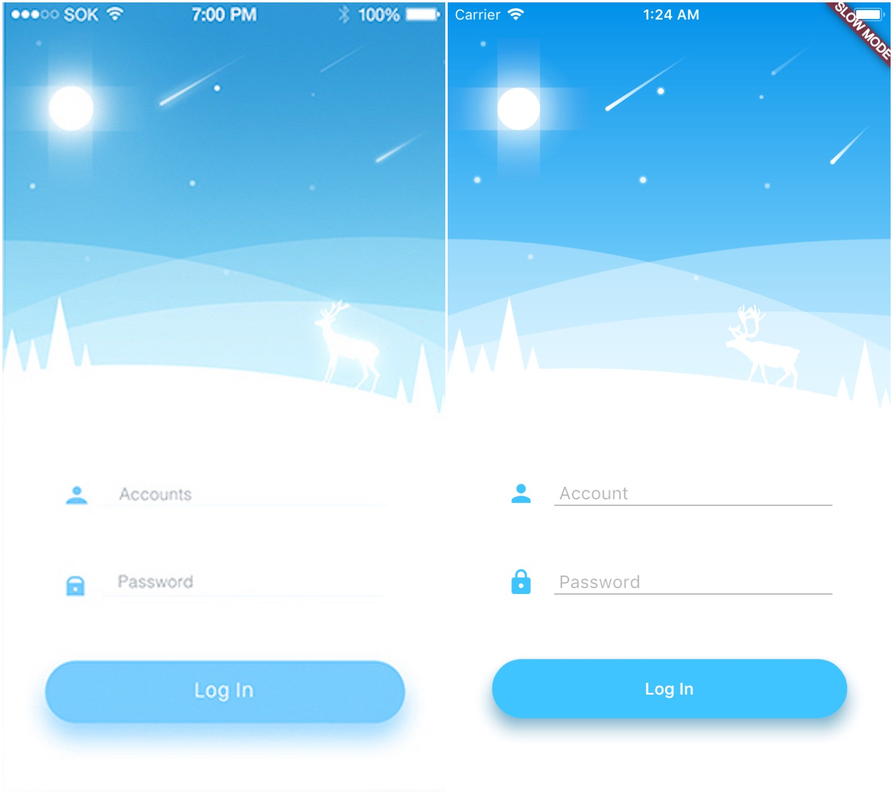

# Weather

*I started from scatch with Flutter and Dart two weeks ago, a refactoring is needed due to the ugliness of the current code since my main purpose is/was to learn them at first.*

The idea behind this weather application (currently only the login page) is to learn how to use Canvas and Animation in Flutter.

It all started from an [inspirational mockup](https://dribbble.com/shots/2695917-Weather-Login-App) two days ago, and here's the *current* result:

The background has been entirely coded (see [`header_painter.dart`](https://github.com/alessandroaime/Weather/blob/master/lib/header_painter.dart)) except for the deer image, which has been **temporarily** appended using the `Stack` widget rather than painting it.

Enjoy it!

**EDIT: I removed my private OpenWeather API key from the repo, if you want to get the weather forecast use your own in the `openweather_api.dart` file (more info at [https://openweathermap.org/appid](https://openweathermap.org/appid).**
